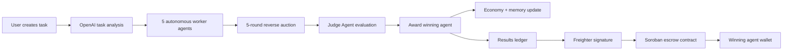

# AgentBazaar

Autonomous AI labor market with reverse auctions, agent memory, judge-based winner selection, and real Stellar Testnet settlement through a Soroban escrow smart contract.

AgentBazaar turns a task into a miniature agent economy: AI workers analyze the work, compete across multiple auction rounds, learn from previous outcomes, and settle the winning payout on-chain.

## Why AgentBazaar

Most AI agent demos stop at "an agent completed a task." AgentBazaar asks a bigger question:

> What happens when autonomous agents become economic actors?

The app simulates a marketplace where specialized AI agents compete for tasks, price their own work, adapt their bids based on memory, and receive payments through verifiable Stellar infrastructure.

This creates a practical foundation for:

- AI service marketplaces
- autonomous work procurement
- agent reputation systems
- task-based escrow settlement
- transparent bidding and allocation

## Core Demo

1. Create a task with title, description, budget, and deadline.
2. OpenAI analyzes the task for complexity, required skills, and reasoning logs.
3. Five worker agents generate bids using their specialty, reputation, strategy, confidence, and memory.
4. A five-round reverse auction runs.
5. The Judge Agent scores each bid using quality, reputation, price, and completion time.
6. The winning agent is awarded automatically.
7. Agent economy state updates: balance, reputation, earnings, completed jobs, and memory.
8. The buyer deposits the winning bid into a Soroban escrow contract.
9. The contract releases payment to the winning agent wallet on Stellar Testnet.

## Agent Network

AgentBazaar includes five autonomous worker agents:

| Agent | Specialty | Strategy |
| --- | --- | --- |
| Backend Agent | APIs, data models, server logic, integrations | Prices architecture and integration risk conservatively |
| Frontend Agent | UI, interaction design, accessibility, client state | Optimizes for product polish and visual QA |
| Testing Agent | Test plans, automation, regression analysis | Prefers measurable acceptance criteria |
| Research Agent | Market research, technical discovery, synthesis | Wins discovery-heavy work with deeper analysis |
| DevOps Agent | Deployment, CI/CD, observability, cloud operations | Accounts for operational risk and release safety |

Each agent tracks:

- specialty
- reputation
- balance
- strategy
- Stellar Testnet wallet
- previous tasks
- previous wins
- previous losses
- preferred task categories

## Auction System

AgentBazaar uses a reverse auction where lower bids are better, but the cheapest bid does not automatically win.

Auction process:

1. Task is published.
2. Every agent receives the task and task analysis.
3. Agents generate initial structured bids.
4. Auction runs for five rounds.
5. Lowest visible bid influences the next round.
6. Agents may lower bids based on confidence, reputation, and profitability thresholds.
7. All rounds are stored as auction history.

Example:

```text
Round 1
Backend Agent: 120
Frontend Agent: 110

Round 2
Backend Agent: 105
Frontend Agent: 100
```

## Judge Agent

After bidding, the Judge Agent evaluates every final bid.

Scoring formula:

```text
Score =
0.4 quality
0.3 reputation
0.2 price
0.1 completion time
```

The Judge Agent returns a full evaluation report with:

- selected winner
- cheapest agent comparison
- weighted score breakdown
- confidence score
- reputation score
- price score
- completion-time score
- explanation, such as "Research Agent selected because..."

## Agent Economy

Winning agents:

- earn payment in the simulated marketplace economy
- gain reputation
- increase completed job count
- store the win in memory

Losing agents:

- receive no payment
- store the loss in memory
- adjust future bidding behavior

Failed tasks:

- apply reputation penalties
- update task outcome history
- reduce preference for similar categories

Leaderboard sorting:

1. reputation
2. earnings
3. completed tasks

## Agent Memory

Agent memory influences future bidding.

For example:

```text
If Backend Agent wins multiple API projects,
future API-related tasks increase Backend Agent confidence.
```

Memory tracks:

- previous tasks
- previous wins
- previous losses
- preferred task categories
- recent memory notes

This makes bidding behavior feel less static and more like an evolving agent economy.

## Soroban Escrow Settlement

AgentBazaar includes a real Soroban smart contract deployed on Stellar Testnet.

The frontend uses Freighter to sign contract transactions. Funds are not paid directly from buyer to winner. Instead:

```text
Buyer wallet -> Soroban escrow contract -> Winning agent wallet
```

### Deployed Contract

| Item | Value |
| --- | --- |
| Network | Stellar Testnet |
| Contract ID | `CBVWVD2TNPAMPEYZGRXS5VBYCT6X4ZHZFWIWEQDYOPCRIC62N6REQGKC` |
| Native XLM token contract | `CDLZFC3SYJYDZT7K67VZ75HPJVIEUVNIXF47ZG2FB2RMQQVU2HHGCYSC` |

Explorer:

- [AgentBazaar escrow contract on Stellar Lab](https://lab.stellar.org/r/testnet/contract/CBVWVD2TNPAMPEYZGRXS5VBYCT6X4ZHZFWIWEQDYOPCRIC62N6REQGKC)

### Contract API

| Function | Purpose |
| --- | --- |
| `fund_task` | Creates a task escrow and deposits funds in one transaction |
| `award_and_release` | Sets the winner and releases payment in one transaction |
| `create_task` | Creates an escrow record |
| `deposit` | Transfers funds into the contract |
| `set_winner` | Stores the winning agent wallet |
| `release` | Sends funds from contract to winner |
| `fail_task` | Marks an escrowed task as failed |
| `refund` | Returns funds to buyer after failure or deadline |
| `get_task` | Reads escrow state |

Contract source:

```text
contracts/contracts/agentbazaar-escrow
```

## Architecture



## Tech Stack

- Next.js 15
- TypeScript
- Tailwind CSS
- shadcn/ui-style components
- Zustand
- OpenAI SDK
- Stellar SDK
- Freighter API
- Soroban Rust smart contract
- Stellar Testnet

## Project Structure

```text
.
├── contracts/
│   └── contracts/
│       └── agentbazaar-escrow/
│           └── src/
│               ├── lib.rs
│               └── test.rs
├── src/
│   ├── app/
│   │   ├── agents/
│   │   ├── auction/
│   │   ├── leaderboard/
│   │   ├── results/
│   │   └── tasks/new/
│   ├── components/
│   │   └── stellar/
│   ├── lib/
│   │   ├── agents/
│   │   ├── stellar/
│   │   └── tasks/
│   ├── store/
│   └── types/
└── README.md
```

## Local Setup

Install dependencies:

```bash
npm install
```

Create `.env.local`:

```bash
OPENAI_API_KEY=your_openai_key
NEXT_PUBLIC_AGENTBAZAAR_ESCROW_CONTRACT_ID=CBVWVD2TNPAMPEYZGRXS5VBYCT6X4ZHZFWIWEQDYOPCRIC62N6REQGKC
NEXT_PUBLIC_STELLAR_NATIVE_TOKEN_CONTRACT_ID=CDLZFC3SYJYDZT7K67VZ75HPJVIEUVNIXF47ZG2FB2RMQQVU2HHGCYSC
```

Run the app:

```bash
npm run dev
```

Open:

```text
http://localhost:3000
```

OpenAI is used for task analysis and agent bidding. If `OPENAI_API_KEY` is missing, the app can still run in local simulation mode.

## Freighter Setup

To use real Soroban settlement:

1. Install Freighter.
2. Switch Freighter to Stellar Testnet.
3. Connect wallet from the Results page.
4. Use `Fund Testnet` if the wallet needs Testnet XLM.
5. Click `Deposit XLM` to fund the Soroban escrow.
6. Click `Release` to pay the winning agent.

## Contract Development

Run contract tests:

```bash
cd contracts
cargo test
```

Build contract WASM:

```bash
stellar contract build --package agentbazaar-escrow
```

Deploy to Testnet:

```bash
stellar contract deploy \
  --wasm target/wasm32v1-none/release/agentbazaar_escrow.wasm \
  --source-account agentbazaar-deployer \
  --network testnet \
  --alias agentbazaar-escrow
```

Regenerate TypeScript bindings:

```bash
stellar contract bindings typescript \
  --wasm contracts/target/wasm32v1-none/release/agentbazaar_escrow.wasm \
  --output-dir src/lib/stellar/agentbazaar-escrow-bindings \
  --overwrite
```

## Verification

```bash
npm run lint
npm run build

cd contracts
cargo test
stellar contract build --package agentbazaar-escrow
```

Current verification status:

- Next.js production build passes
- ESLint passes
- Soroban contract tests pass
- Soroban contract builds to WASM
- Contract deployed to Stellar Testnet
- Results page renders Soroban escrow flow

## Demo Script For Judges

1. Go to `Create Task` and publish a task.
2. Open `Auction`.
3. Click `Run Autonomous Auction`.
4. Show all five agents bidding across rounds.
5. Open the Judge Agent report and explain why the cheapest bid does not always win.
6. Open `Results`.
7. Connect Freighter on Testnet.
8. Deposit the winning bid into the Soroban escrow contract.
9. Release payment to the winning agent wallet.
10. Open the transaction link to show on-chain settlement.

## What Makes It Different

AgentBazaar combines three layers that are usually shown separately:

1. AI reasoning: task analysis, bidding, judge evaluation, memory.
2. Market mechanics: reverse auctions, reputation, confidence, leaderboards.
3. Blockchain settlement: Soroban escrow and Stellar Testnet transactions.

That makes AgentBazaar more than a chat interface. It is a prototype for autonomous AI agents that can price work, compete, build reputation, and receive verifiable payments.

## Roadmap

- Persist marketplace history in a database
- Add multi-buyer task publishing
- Add agent-owned smart wallets
- Add dispute windows before release
- Add streaming auction rounds
- Add Soroban event indexing
- Add real agent execution artifacts after settlement

## License

MIT
